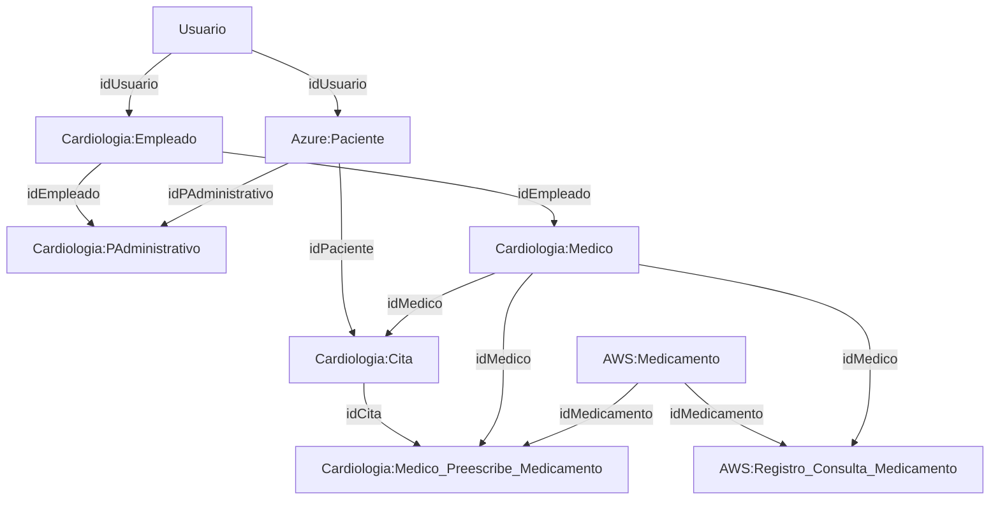

# Documentación de Bases de Datos Hospitalarias Distribuidas

## Índice
1. [Introducción](#introducción)
2. [Arquitectura General y Relación entre Bases](#arquitectura-general-y-relación-entre-bases)
3. [Descripción de cada Base de Datos](#descripción-de-cada-base-de-datos)
    - [Departamento](#departamento)
    - [Usuario](#usuario)
    - [Cardiologia](#cardiologia)
    - [Azure](#azure)
    - [AWS](#aws)
4. [Relaciones y Validaciones entre Bases](#relaciones-y-validaciones-entre-bases)
5. [Triggers y Validaciones Distribuidas](#triggers-y-validaciones-distribuidas)
6. [Consideraciones y Cuidados](#consideraciones-y-cuidados)
7. [Apuntes y Buenas Prácticas](#apuntes-y-buenas-prácticas)
8. [Ejemplo de Flujo de Datos](#ejemplo-de-flujo-de-datos)

---

## Introducción

Este sistema modela la gestión hospitalaria distribuida en varias bases de datos, cada una con un propósito específico y validaciones cruzadas mediante `dblink`. El objetivo es garantizar integridad, trazabilidad y seguridad en la gestión de usuarios, pacientes, empleados, equipamiento, medicamentos y citas.

## Arquitectura General y Relación entre Bases

El sistema está compuesto por las siguientes bases de datos:

- **Departamento**: Define los departamentos hospitalarios.
- **Usuario**: Contiene los datos personales de todos los usuarios del sistema.
- **Cardiologia**: Gestiona empleados, equipamiento, médicos, administrativos, citas y relaciones clínicas.
- **Azure**: Gestiona pacientes y sus historias clínicas.
- **AWS**: Gestiona farmacias y medicamentos.

Las bases están relacionadas mediante validaciones cruzadas usando `dblink`, lo que permite mantener la integridad referencial a pesar de estar distribuidas.

### Diagrama de Relaciones (Simplificado)

## Descripción de cada Base de Datos

### Departamento
- **Tabla:** `Departamento`
    - `idDepartamento` (PK)
    - `Nombre`
    - `Ubicacion`
- **Propósito:** Define los departamentos hospitalarios. Es referenciada por otras bases para validar la pertenencia de empleados y equipamiento.

### Usuario
- **Tablas:**
    - `Usuario`: Datos personales, género, email, dirección, fecha de nacimiento.
    - `TelUsuario`: Teléfonos asociados a usuarios.
- **Propósito:** Es la base de datos maestra de usuarios. Todos los empleados y pacientes deben existir primero aquí.
- **Validaciones:**
    - El género debe ser 'M' o 'F'.
    - El email es único.

### Cardiologia
- **Tablas principales:**
    - `Equipamiento`: Equipos médicos asociados a un departamento.
    - `Empleado`: Personal del departamento, referenciando a usuarios.
    - `PAdministrativo` y `Medico`: Subtipos de empleados.
    - `Cita`: Relaciona médicos y pacientes.
    - Tablas de rompimiento: `Medico_Equipo`, `PAdmin_Modifica_Paciente`, `Actualizaciones_HistoriaClinica`, `Medico_Preescribe_Medicamento`, `Registro_Consulta_Medicamento`, `PAdmin_Gestiona_Cita`.
- **Propósito:** Gestiona la operación clínica y administrativa del departamento.
- **Validaciones:**
    - Uso extensivo de triggers para validar existencia de claves foráneas en otras bases (usuarios, pacientes, medicamentos, historias clínicas).
    - Restricciones de unicidad y consistencia de estado.

### Azure
- **Tablas principales:**
    - `Paciente`: Pacientes del hospital, referenciando a usuarios y administrativos.
    - `HistoriaClinica`: Historia clínica de cada paciente.
- **Propósito:** Gestiona la información clínica de los pacientes.
- **Validaciones:**
    - Validación de existencia de usuario y administrativo mediante `dblink`.
    - Creación automática de historia clínica al registrar un paciente.

### AWS
- **Tablas principales:**
    - `Farmacia`: Farmacias del hospital.
    - `Medicamento`: Catálogo de medicamentos.
    - `FarmaciaPosee`: Stock de medicamentos en cada farmacia.
    - `FarmaciaEntrega`: Entregas de medicamentos a pacientes.
- **Propósito:** Gestiona el inventario y entrega de medicamentos.
- **Validaciones:**
    - Validación de existencia de paciente mediante `dblink`.
    - Triggers para verificar y actualizar stock antes de entregar medicamentos.

## Relaciones y Validaciones entre Bases

- **dblink:** Se utiliza para validar la existencia de claves foráneas en otras bases de datos, por ejemplo:
    - Validar que un `idUsuario` exista en la base `Usuario` antes de crear un empleado o paciente.
    - Validar que un `idDepartamento` exista en la base `Departamento` antes de crear equipamiento o empleados.
    - Validar que un `idMedicamento` exista en la base `AWS` antes de prescribir o consultar medicamentos.
    - Validar que un `idPaciente` exista en la base `Azure` antes de crear citas o entregar medicamentos.

- **Triggers:** Se emplean triggers para realizar estas validaciones en operaciones de `INSERT` y `UPDATE`, asegurando la integridad referencial distribuida.

## Triggers y Validaciones Distribuidas

- **Validación de existencia:** Antes de insertar o actualizar registros que dependen de otras bases, se ejecutan funciones que consultan la base remota usando `dblink`.
- **Prevención de duplicados:** Se valida que no existan duplicados lógicos, por ejemplo, que un usuario no sea empleado o paciente más de una vez.
- **Actualización automática:** Algunos triggers generan registros automáticamente, como la creación de la historia clínica al registrar un paciente.
- **Control de stock:** Antes de entregar medicamentos, se verifica y actualiza el stock en la farmacia correspondiente.

## Consideraciones y Cuidados

1. **Habilitar dblink:**
   - Es necesario habilitar la extensión `dblink` en todas las bases involucradas.
   - Los usuarios de base de datos deben tener permisos para usar `dblink` y acceder a las bases remotas.

2. **Consistencia de credenciales:**
   - Las conexiones `dblink` requieren credenciales explícitas. Mantenerlas seguras y actualizadas.

3. **Atomicidad y errores:**
   - Si una validación con `dblink` falla, la operación se aborta con un mensaje claro.
   - Los triggers pueden generar excepciones que deben ser manejadas por la aplicación cliente.

4. **Sincronización de IDs:**
   - Los IDs deben ser únicos y consistentes entre bases. Usar `SERIAL` o `GENERATED ALWAYS AS IDENTITY` para evitar colisiones.

5. **Rendimiento:**
   - El uso de `dblink` puede impactar el rendimiento en operaciones masivas. Se recomienda su uso para operaciones críticas de integridad.

6. **Mantenimiento:**
   - Cambios en la estructura de una base pueden requerir ajustes en los triggers y funciones de otras bases.

7. **Transacciones distribuidas:**
   - No hay soporte nativo para transacciones distribuidas entre bases. Si una operación falla en una base remota, no se revierte automáticamente en la local.

## Apuntes y Buenas Prácticas

- **Documentar siempre los triggers y funciones.**
- **Probar exhaustivamente los triggers con datos reales y casos límite.**
- **Evitar dependencias circulares entre bases.**
- **Mantener consistencia en los nombres de campos y tipos de datos entre bases relacionadas.**
- **Revisar periódicamente los permisos de los usuarios de base de datos.**
- **Realizar respaldos frecuentes de todas las bases.**
- **Actualizar las credenciales de `dblink` ante cualquier cambio de seguridad.**

## Ejemplo de Flujo de Datos

1. **Registro de un nuevo usuario:**
    - Se inserta en la base `Usuario`.
2. **Creación de un empleado:**
    - Se valida que el usuario exista en `Usuario` mediante `dblink`.
    - Se inserta en `Cardiologia.Empleado`.
3. **Registro de un paciente:**
    - Se valida que el usuario exista en `Usuario` y el administrativo en `Cardiologia`.
    - Se inserta en `Azure.Paciente`.
    - Se crea automáticamente la historia clínica.
4. **Creación de una cita:**
    - Se valida que el paciente exista en `Azure` y el médico en `Cardiologia`.
    - Se inserta en `Cardiologia.Cita`.
5. **Prescripción de medicamento:**
    - Se valida que el medicamento exista en `AWS` y el paciente en `Azure`.
    - Se inserta en `Cardiologia.Medico_Preescribe_Medicamento`.
6. **Entrega de medicamento:**
    - Se valida que el paciente exista en `Azure` y que haya stock suficiente en la farmacia (`AWS`).
    - Se actualiza el stock y se registra la entrega.

---

## Conclusión

Este sistema distribuye la gestión hospitalaria en varias bases de datos especializadas, garantizando integridad y trazabilidad mediante validaciones cruzadas y triggers. El uso de `dblink` permite mantener la coherencia de los datos en un entorno distribuido, aunque requiere cuidados especiales en cuanto a permisos, rendimiento y mantenimiento.

Para cualquier modificación estructural, se recomienda revisar y actualizar la documentación y los triggers involucrados. 